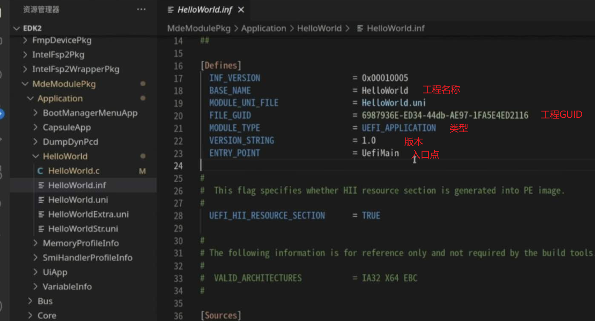

BaseTools目录: 编译EDK2所需的工具(EDK2有自己的工具链,不依赖系统的)

EDK2是UEFI标准的实现源码

EDK2的源码非常模块化,每一个Pkg都是一个解决方案

## Pkg内部结构

以MdeModulePkg为例子

### MdeModulePkg.dsc

DSC文件: Platform Description File, 用来描述整个Pkg,再进一步切分之后就是有具体功能的工程

工程目录下的 inf文件描述工程的信息

### MdeModulePkg.dec

DEC文件: Package Declaration File,定义公开的数据和接口(其它的Pkg可以调用这些公开的内容,是UEFI接口的实现)

